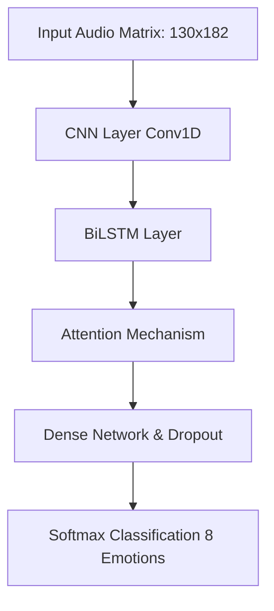

# EchoPersona: Full-Stack Audio Emotion Recognition System

Welcome to the comprehensive documentation for the **EchoPersona** project. This document explains the entire pipeline, the modules, the AI model architecture, and how the data flows from a user speaking into the microphone to the final emotion prediction on the screen.

---

## 1. Project Overview
EchoPersona is an end-to-end deep learning web application that detects human emotions from speech. It is built to analyze the pitch, tone, and tempo of an audio file and classify it into one of 8 human emotions:
* Neutral, Calm/Shy, Happy, Sad, Angry, Fearful, Disgusted, Surprised.

The project is split into three main tiers:
1. **The AI / Machine Learning Pipeline** (Data extraction & Model training)
2. **The Backend API** (FastAPI server to host the AI)
3. **The Frontend UI** (Modern web interface for user interaction)

---

## 2. The Data Pipeline & Feature Extraction (`src/features.py`)

Raw audio (`.wav` files) cannot be fed directly into a neural network. It must be converted into a mathematical matrix of features. We use the `librosa` library to extract 5 distinct audio features:

1. **MFCC (Mel-Frequency Cepstral Coefficients):** Extracts the "shape" of the vocal tract. It's the most important feature for human speech.
2. **Chroma:** Represents the 12 different pitch classes of music/audio. Helps identify tone.
3. **Mel Spectrogram:** A visual representation of frequencies over time, scaled to how humans actually hear sound.
4. **Zero Crossing Rate (ZCR):** The rate at which the audio signal changes from positive to negative. Helps distinguish noisy/harsh sounds (like anger) from smooth ones.
5. **Root Mean Square (RMS):** Measures the loudness/energy of the audio.

**How it works:**
The script slices a 3-second audio clip into `130` tiny time steps. For each time step, it extracts `182` numerical values combining the 5 features above.
The final shape of the data entering our AI model is a 3D tensor: `(Number of Files, 130 time steps, 182 features)`.

---

## 3. The AI Model Architecture (`src/model.py`)

EchoPersona uses a highly advanced **CNN + BiLSTM + Attention** architecture. Here is exactly what happens inside the brain of the AI:

### Layer Details:
* **CNN (Convolutional Neural Network - `Conv1D`):**
  This layer slides across the 130 time steps and extracts "local" patterns. Just like a CNN detects edges in an image, this 1D CNN detects sharp spikes in volume or sudden changes in pitch.
* **BiLSTM (Bidirectional Long Short-Term Memory):**
  A standard Recurrent Neural Network forgets early parts of the audio by the time it reaches the end. LSTMs have "memory". A *Bidirectional* LSTM reads the audio forwards *and* backwards simultaneously to perfectly understand the context of the entire sentence.
* **Attention Mechanism:**
  Not all parts of a sentence contain emotion. If a user says "I am so... MAD!", the word "MAD" holds 90% of the emotional weight. The Attention layer assigns mathematical "weights" to focus the network on the most emotionally dense time steps and ignore silence or background noise.
* **Output:**
  The final Dense layers compress this information down to 8 numbers, and a `Softmax` activation converts them into probabilities (e.g., 80% Angry, 10% Sad...).

---

## 4. Model Training (`src/train.py`)

Once the architecture is defined, `train.py` handles the learning process.
* **Optimizer:** We use `Adam`, which dynamically adjusts how fast the AI learns.
* **Callbacks:** 
  * `ModelCheckpoint`: Constantly saves the best version of the model to `models/best_model.h5`.
  * `EarlyStopping`: If the AI stops improving, training is halted early so it doesn't "overfit" (memorize) the data.
  * `ReduceLROnPlateau`: If the AI gets stuck, it lowers its learning speed to carefully find a better mathematical solution.

---

## 5. The Backend API (`backend/app.py`)

The backend is built using **FastAPI**, a lightning-fast Python web framework.
* When the server starts, it loads the saved `best_model.h5` into system memory so it doesn't have to load it from the hard drive every time.
* It creates an endpoint URL at `POST /predict/`.
* When a user uploads an audio file, FastAPI saves it temporarily, passes it through the exact same `librosa` feature extraction from step 2, and asks the AI model for a prediction.
* It returns a clean JSON response back to the user.

---

## 6. The Frontend UI (`frontend/`)

The user interface consists of three files:
1. `index.html`: The structural layout containing the recording buttons, file uploader, and prediction result cards.
2. `style.css`: Implements a modern **Glassmorphism** design. This utilizes semi-transparent backgrounds with backdrop-blurs, vibrant gradients, and smooth CSS animations for a premium look.
3. `script.js`: The brain of the frontend. 
   * It uses the browser's native `MediaRecorder API` to access the user's microphone securely.
   * It packages the recorded audio into a file payload and uses the `fetch()` API to send it to our FastAPI backend.
   * It parses the JSON response and animates the progress bars to show exactly how confident the AI is in its emotional prediction.

---

### Summary of the Data Flow:
1. User clicks "Record" on the web UI.
2. `script.js` captures their voice and sends it to FastAPI via `POST /predict/`.
3. FastAPI saves the `.wav` file and runs `features.py`.
4. `features.py` turns the audio into a 130x182 numerical matrix.
5. `best_model.h5` (CNN+BiLSTM+Attention) analyzes the matrix and predicts the emotion.
6. FastAPI sends the prediction back to the frontend.
7. The web UI lights up with the detected emotion!
